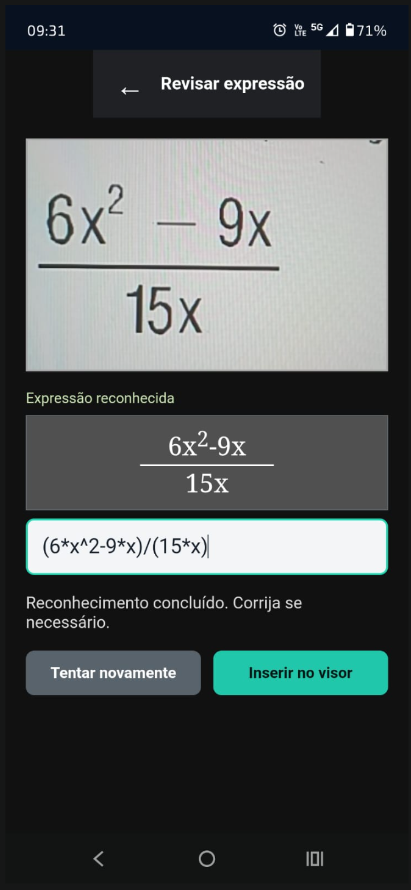
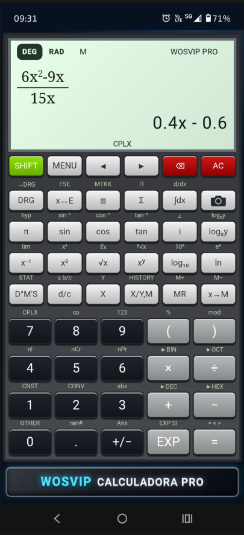
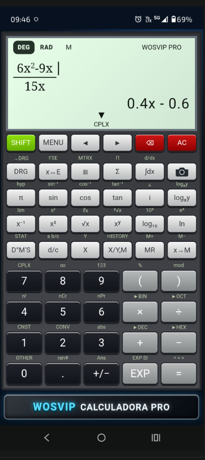

# WOSVIP Calculadora PRO

Calculadora científica instalável para computador e smartphone, desenvolvida para cálculos numéricos, expressões algébricas, engenharia, estudos e conversões de unidades.

<p align="center">
  <a href="https://wosvip.github.io/wosvip-calculadora-pro/"><strong>ABRIR A CALCULADORA</strong></a>
</p>

## Visão geral

A WOSVIP Calculadora PRO combina o visual de uma calculadora científica física com recursos modernos de navegador. A expressão aparece formatada no visor enquanto é digitada, e o resultado é atualizado automaticamente sempre que o cálculo já pode ser resolvido.

O projeto funciona como **Progressive Web App (PWA)**: pode ser instalado pelo Chrome ou Edge e aberto em uma janela própria, com ícone na tela inicial ou no menu de aplicativos.

## Capturas validadas

<table>
  <tr>
    <td align="center"><strong>Reconhecimento da fórmula</strong></td>
    <td align="center"><strong>Resultado simbólico</strong></td>
    <td align="center"><strong>Acesso ao passo a passo</strong></td>
  </tr>
  <tr>
    <td></td>
    <td></td>
    <td></td>
  </tr>
</table>

## Principais recursos

### Calculadora científica

- Operações básicas, porcentagem e troca de sinal
- Potências, raiz quadrada, raiz cúbica e raiz de índice variável
- Seno, cosseno, tangente e funções inversas
- Modos angular **DEG** e **RAD**
- Logaritmo decimal, logaritmo natural, exponencial e constante π
- Fatorial, combinações, permutações e módulo
- Parênteses e edição da expressão com setas
- Números complexos, memória e histórico persistente

### Cálculo instantâneo

O resultado aparece automaticamente enquanto a expressão é digitada. A tecla **=** confirma o resultado, permitindo continuar o cálculo a partir da resposta anterior.

Exemplo:

```text
32 × 2 = 64
64 × 2 = 128
```

### Resolução passo a passo

A seta **▼**, posicionada abaixo do resultado, abre um card explicativo. De acordo com a expressão, ele apresenta:

1. Expressão original
2. Resolução de parênteses
3. Potências, raízes ou funções científicas
4. Multiplicações e divisões
5. Adições e subtrações
6. Redução de coeficientes e expoentes em expressões algébricas
7. Resultado final

Exemplo de simplificação simbólica:

```text
(6x² − 9x) / 15x
= 6x²/15x − 9x/15x
= 0,4x − 0,6
```

### Reconhecimento matemático pela câmera

A tecla com o ícone de câmera permite:

1. Fotografar uma expressão matemática
2. Ajustar a área de captura
3. Reconhecer números, operadores, frações, expoentes e variáveis
4. Revisar e corrigir o conteúdo identificado
5. Inserir a expressão formatada diretamente no visor

O reconhecimento especializado usa o modelo [FormulaNet](https://huggingface.co/alephpi/FormulaNet) por meio do [Transformers.js](https://huggingface.co/docs/transformers.js/), inspirado no projeto aberto [Texo](https://github.com/alephpi/Texo).

> Na primeira utilização da câmera, é necessária conexão com a internet para baixar o modelo matemático. Depois do download, o navegador mantém o modelo armazenado em cache.

### Ferramentas adicionais

- Integral definida e derivada numérica
- Limites, somatórios e produtórios
- Conversor de unidades com categorias de engenharia
- Juros simples e compostos
- Cálculo de parcelas de financiamento
- Gráfico de funções matemáticas
- Conversões binárias, octais, decimais e hexadecimais
- Memória de resultados e histórico local

## Instalação no smartphone

1. Abra [a versão publicada](https://wosvip.github.io/wosvip-calculadora-pro/) no Chrome.
2. Toque no botão **Instalar** ou abra o menu do navegador.
3. Escolha **Instalar aplicativo**.
4. Confirme a instalação.
5. Abra a WOSVIP Calculadora PRO pelo ícone criado no aparelho.

## Instalação no computador

1. Abra [a calculadora](https://wosvip.github.io/wosvip-calculadora-pro/) no Chrome ou Edge.
2. Clique no ícone de instalação localizado na barra de endereço ou use o menu do navegador.
3. Selecione **Instalar WOSVIP Calculadora PRO**.
4. O aplicativo será aberto em uma janela própria.

## Funcionamento offline

Depois da primeira abertura, a interface e as funções principais são armazenadas pelo service worker. Assim, a calculadora pode continuar funcionando sem conexão. O reconhecimento por imagem também poderá reutilizar o modelo quando ele já estiver presente no cache do navegador.

## Privacidade

- Os cálculos são processados no próprio dispositivo.
- Histórico, memória e preferências ficam armazenados localmente no navegador.
- A imagem capturada pela câmera é processada pelo modelo executado no navegador.
- O aplicativo não exige criação de conta.

## Tecnologias

- HTML5
- CSS3
- JavaScript
- Canvas
- Service Worker e Web App Manifest
- Transformers.js e ONNX Runtime Web para reconhecimento matemático
- GitHub Pages para publicação

## Estrutura principal

```text
index.html             Interface
styles.css             Visual e responsividade
app.js                 Motor da calculadora
formula-ocr-worker.js  Reconhecimento matemático
manifest.json          Configuração de instalação
sw.js                  Cache e funcionamento offline
```

## Compatibilidade

O aplicativo foi projetado para navegadores modernos baseados em Chromium, incluindo Chrome e Edge, em Android e Windows. Funções de câmera dependem da permissão concedida pelo usuário e da disponibilidade do navegador.

---

<p align="center"><strong>WOSVIP Calculadora PRO</strong><br>Ciência, engenharia e produtividade em uma calculadora instalável.</p>
