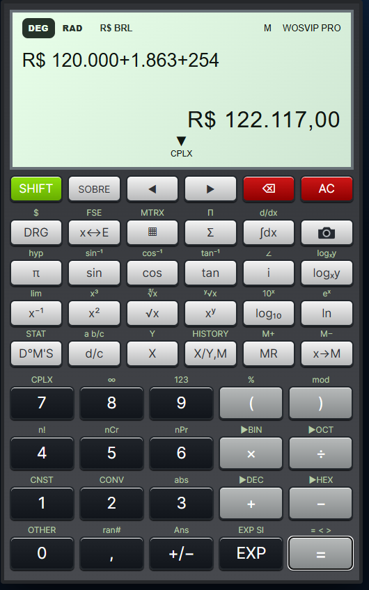
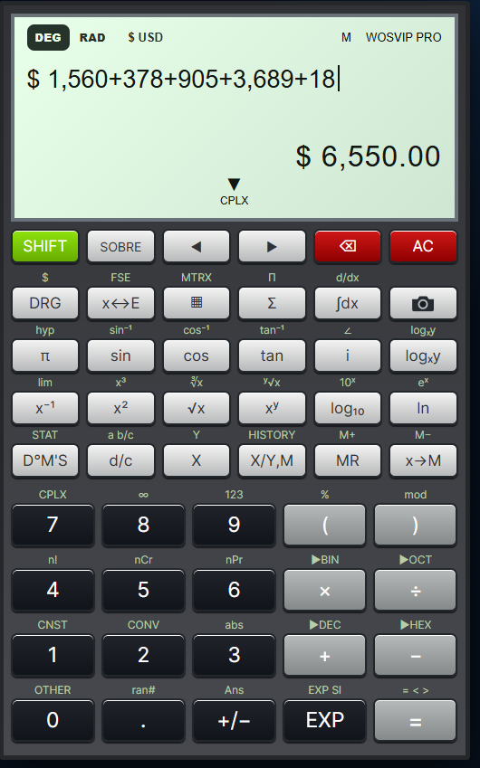

# WOSVIP Calculadora PRO®

> **Aplicação proprietária WOSVIP.** Esta publicação contém somente os arquivos necessários para executar e instalar a calculadora. O código-fonte original é mantido em repositório privado. Consulte a [Licença Proprietária](PROPRIETARY-LICENSE.md).

<p align="center">
  <strong>Calculadora científica instalável com reconhecimento matemático por câmera e resolução passo a passo.</strong>
</p>

<p align="center">
  
  
  
  
  
  
</p>

<p align="center">
  <a href="https://wosvip.github.io/wosvip-calculadora-pro/"><strong>ABRIR A WOSVIP CALCULADORA PRO</strong></a>
</p>

## Sobre o projeto

A **WOSVIP Calculadora PRO** combina a aparência de uma calculadora científica física com recursos modernos para matemática, engenharia e estudos. O projeto funciona diretamente no navegador e também pode ser instalado como aplicativo no Windows e no Android.

A expressão é formatada no visor, o resultado numérico aparece instantaneamente quando possível e a seta **▼** abre uma explicação matemática organizada. A câmera permite fotografar fórmulas, revisar o reconhecimento e enviar a expressão para o visor.

## Aplicativo validado

O enquadramento e a instalação foram testados como PWA no **Windows**, no smartphone **Moto G77** e em **tablet Android**. O layout responsivo amplia o visor e as teclas em telas maiores e mantém a identidade animada **WOSVIP Calculadora PRO** visível no rodapé.

### Demonstração em vídeo

<p align="center">
  <a href="https://wosvip.github.io/wosvip-calculadora-pro/docs/videos/wosvip-calculadora-pro.mp4?v=3" target="_blank" rel="noopener">
    
  </a>
</p>

<p align="center">
  <a href="https://wosvip.github.io/wosvip-calculadora-pro/docs/videos/wosvip-calculadora-pro.mp4?v=3" target="_blank" rel="noopener"><strong>▶ ASSISTIR À DEMONSTRAÇÃO DA CALCULADORA</strong></a><br>
  <sub>Vídeo curto mostrando a utilização no celular e a identidade animada da Calculadora PRO.</sub>
</p>

### Como instalar no Windows

<p align="center">
  <a href="https://wosvip.github.io/wosvip-calculadora-pro/docs/videos/INSTALANDO-WOSVIP-CALCULADORA-PRO-WINDOWS.mp4?v=1" target="_blank" rel="noopener">
    
  </a>
</p>

<p align="center">
  <a href="https://wosvip.github.io/wosvip-calculadora-pro/docs/videos/INSTALANDO-WOSVIP-CALCULADORA-PRO-WINDOWS.mp4?v=1" target="_blank" rel="noopener"><strong>▶ COMO INSTALAR A WOSVIP CALCULADORA PRO NO WINDOWS</strong></a><br>
  <sub>Guia completo em vídeo: acesso, instalação como aplicativo e demonstração dos principais recursos.</sub>
</p>

### Como instalar no smartphone

<p align="center">
  <a href="https://wosvip.github.io/wosvip-calculadora-pro/docs/videos/INSTALANDO-WOSVIP-CALCULADORA-PRO-SMARTPHONE.mp4?v=1" target="_blank" rel="noopener">
    
  </a>
</p>

<p align="center">
  <a href="https://wosvip.github.io/wosvip-calculadora-pro/docs/videos/INSTALANDO-WOSVIP-CALCULADORA-PRO-SMARTPHONE.mp4?v=1" target="_blank" rel="noopener"><strong>▶ COMO INSTALAR A WOSVIP CALCULADORA PRO NO SMARTPHONE</strong></a><br>
  <sub>Guia completo em vídeo: acesso pelo navegador, instalação como aplicativo e utilização no celular.</sub>
</p>

<table>
  <tr>
    <td align="center"><strong>Aplicativo no Moto G77</strong></td>
    <td align="center"><strong>Aplicativo instalado no Windows</strong></td>
  </tr>
  <tr>
    <td align="center"></td>
    <td align="center"></td>
  </tr>
</table>

## Recursos principais

### Calculadora científica

- Operações básicas, porcentagem e troca de sinal
- Potências e raízes quadrada, cúbica e de índice variável
- Seno, cosseno, tangente e funções trigonométricas inversas
- Modos angulares **DEG** e **RAD**
- Logaritmo decimal, logaritmo natural, exponenciais e constante π
- Fatorial, combinações, permutações e módulo
- Parênteses e edição da expressão pelas setas direcionais
- Memória, resposta anterior e histórico persistente
- Números complexos e conversões entre bases numéricas

### Modo numérico brasileiro

A calculadora utiliza a apresentação numérica adotada no Brasil:

- **vírgula** como separador decimal;
- **ponto** como separador de milhares;
- tecla decimal adaptada ao padrão brasileiro;
- resultados formatados para facilitar a leitura de números extensos.

Exemplos: `1.234,56`, `10.000` e `0,25`.

Os cálculos mantêm a precisão interna enquanto o visor apresenta os valores no formato brasileiro.

### Resultado instantâneo e tecla igual

O resultado aparece enquanto a expressão é digitada. A tecla **=** confirma a resposta e permite continuar o cálculo usando o resultado anterior.

Exemplo: `32 × 2` mostra `64`; depois de confirmar, é possível continuar com `× 2` para obter `128`.

Depois que um resultado é confirmado, funções unárias podem ser aplicadas diretamente ao valor confirmado. Por exemplo: confirme `6` e pressione `√x` para calcular `√(6)`; confirme `22,5` e pressione `sin` para calcular `sin(22,5)` no modo angular selecionado.

### Tecla SOBRE

A tecla **SOBRE** abre, dentro da própria calculadora, uma apresentação completa do aplicativo. O card reúne os recursos científicos, o funcionamento da câmera, a instalação, o modo offline, a privacidade, as tecnologias e as observações de precisão sem retirar o usuário do cálculo.

## Resolução matemática passo a passo

A seta **▼** abre uma tela de resolução com fundo escuro, fórmulas em destaque e divisórias discretas. O objetivo não é apenas mostrar o resultado, mas explicar como ele foi obtido.

Dependendo do cálculo, o aplicativo apresenta:

- ordem das operações;
- transformação e desenvolvimento de potências;
- raízes e funções aplicadas ao resultado confirmado;
- simplificação de frações algébricas;
- fatoração e cancelamento de fatores comuns;
- restrições da expressão original;
- somatórios **Σ** e produtórios **Π**, com substituição termo a termo;
- equações do primeiro grau;
- equações do segundo grau com coeficientes, discriminante, fórmula de Bhaskara e verificação das raízes;
- gráfico cartesiano da parábola em equações do segundo grau;
- porcentagem contextual e porcentagem financeira em duas etapas;
- raízes reais ou complexas.

<p align="center">
  
</p>

### Exemplos do passo a passo

#### Potência

Para `12²`, a resolução desenvolve a potência em multiplicação repetida:

```text
12²
12 × 12
12 × 12 = 144
Resultado: 144
```

Para `5³`:

```text
5³
5 × 5 × 5
5 × 5 = 25
25 × 5 = 125
Resultado: 125
```

#### Raiz e funções sobre resultado confirmado

Exemplo com raiz:

```text
6 =
√x
√(6) = 2,44948974278...
```

Exemplo trigonométrico em **DEG**:

```text
180 ÷ 8 = 22,5
sin
sin(22,5°) = 0,382683432365...
```

A mesma expressão pode ser recalculada em **RAD**, respeitando o modo angular selecionado.

#### Somatório Σ

Exemplo:

```text
Σ X=1…4 (X)
```

A resolução mostra os limites, substitui cada valor de `X` e soma progressivamente:

```text
X = 1 → 1
X = 2 → 2
X = 3 → 3
X = 4 → 4

1 + 2 + 3 + 4
1 + 2 = 3
3 + 3 = 6
6 + 4 = 10

Resultado: 10
```

#### Produtório Π

Exemplo:

```text
Π X=1…4 (X)
```

A resolução desenvolve o produto termo a termo:

```text
1 × 2 × 3 × 4
1 × 2 = 2
2 × 3 = 6
6 × 4 = 24

Resultado: 24
```

#### Equação do segundo grau

Exemplo:

```text
X² − 7X + 10 = 0
```

A resolução identifica:

```text
a = 1
b = -7
c = 10
```

Depois calcula o discriminante:

```text
Δ = b² − 4ac
Δ = (-7)² − 4 × 1 × 10
Δ = 49 − 40
Δ = 9
```

Aplica Bhaskara:

```text
x = (-b ± √Δ) / 2a
x = (7 ± 3) / 2
x₁ = 5
x₂ = 2
```

Ao final, o aplicativo verifica as raízes na equação original e apresenta um **gráfico cartesiano da parábola**, incluindo vértice, eixo de simetria, intercepto em `Y`, concavidade e raízes reais quando existirem.

### Funções científicas — exemplos de uso

| Função | Exemplo | Resultado esperado |
|---|---|---|
| Seno | `sin(30)` em DEG | `0,5` |
| Cosseno | `cos(60)` em DEG | `0,5` |
| Tangente | `tan(45)` em DEG | `1` |
| Raiz quadrada | `√(81)` | `9` |
| Raiz cúbica | `∛(27)` | `3` |
| Quadrado | `12²` | `144` |
| Cubo | `5³` | `125` |
| Logaritmo decimal | `log(1000)` | `3` |
| Logaritmo natural | `ln(e)` | `1` |
| Exponencial | `e^1` | `e` |
| Inverso | `1/4` ou `x⁻¹` sobre `4` | `0,25` |
| Fatorial | `5!` | `120` |

> [!NOTE]
> Nas funções trigonométricas, confira sempre se o modo **DEG** ou **RAD** corresponde à unidade angular desejada.

## Limites

A calculadora possui cálculo numérico de limites para expressões que utilizam a variável `X`.

### Como usar

1. Digite uma expressão contendo `X`.
2. Acione a função **lim**.
3. Informe o valor para o qual `X` deve tender.
4. A calculadora avalia numericamente a aproximação ao redor do ponto informado.

### Exemplo clássico

Digite:

```text
sin(X)/X
```

Acione **lim** e informe:

```text
0
```

A calculadora aproxima a expressão pelos dois lados de `0` e retorna valor próximo de:

```text
lim X→0 sin(X)/X = 1
```

### Outro exemplo

Digite:

```text
(X²−1)/(X−1)
```

Calcule o limite para:

```text
X → 1
```

Como a expressão se aproxima de `2` nos pontos vizinhos de `1`, o resultado numérico esperado é:

```text
lim X→1 (X²−1)/(X−1) = 2
```

O recurso é numérico e foi projetado para estudar o comportamento da função próximo ao ponto indicado. Em casos de descontinuidade, divergência ou comportamentos diferentes pela esquerda e pela direita, o resultado deve ser interpretado de acordo com a natureza matemática da função.

## Reconhecimento matemático pela câmera

A tecla de câmera abre um fluxo próprio para captura de expressões:

1. Abra a câmera ou selecione uma imagem.
2. Ajuste o enquadramento da fórmula.
3. Aguarde o reconhecimento matemático.
4. Revise e, se necessário, edite a expressão reconhecida.
5. Toque em **Inserir no visor**.
6. Use a seta **▼** para consultar a resolução.

O campo de revisão é importante para remover numeração de exercícios ou corrigir algum caractere antes de calcular.

> [!IMPORTANT]
> **A fórmula reconhecida pode ser corrigida imediatamente.** Se o conteúdo exibido pela câmera não estiver idêntico à fórmula original, toque no campo da fórmula reconhecida e edite números, sinais, letras ou expoentes. Depois de conferir a correção, toque em **Inserir no visor** para realizar o cálculo.

### Expressões algébricas com duas variáveis

O leitor e o motor simbólico aceitam `x`, `y`, produtos como `2xy`, potências e frações algébricas.

<table>
  <tr>
    <td align="center"><strong>Expressão reconhecida</strong></td>
    <td align="center"><strong>Simplificação simbólica</strong></td>
  </tr>
  <tr>
    <td align="center"></td>
    <td align="center"></td>
  </tr>
</table>

### Equações do primeiro e segundo graus

O aplicativo identifica os coeficientes, resolve a equação e apresenta as transformações matemáticas.

<table>
  <tr>
    <td align="center"><strong>Leitura e revisão</strong></td>
    <td align="center"><strong>Equação do primeiro grau</strong></td>
    <td align="center"><strong>Equação do segundo grau</strong></td>
  </tr>
  <tr>
    <td align="center"></td>
    <td align="center"></td>
    <td align="center"></td>
  </tr>
</table>

## Modo monetário inteligente

Um diferencial exclusivo da **WOSVIP Calculadora PRO**: cálculos científicos e monetários reunidos na mesma interface.

A tecla **DRG** mantém as configurações de ângulo e formato numérico. Com **SHIFT + DRG**, o símbolo **$** abre o seletor monetário com Real brasileiro, Dólar americano, Euro e Libra esterlina.

<table>
  <tr>
    <td align="center"><br><strong>Configuração científica</strong><br>Escolha DEG ou RAD e o padrão numérico BR ou US.</td>
    <td align="center"><br><strong>Seleção de moeda</strong><br>Ative Real, Dólar, Euro ou Libra com SHIFT + DRG.</td>
  </tr>
  <tr>
    <td align="center"><br><strong>Real brasileiro</strong><br>Símbolo R$, milhares com ponto e centavos com vírgula.</td>
    <td align="center"><br><strong>Dólar americano</strong><br>Símbolo $, milhares com vírgula e centavos com ponto.</td>
  </tr>
</table>

- O símbolo da moeda aparece antes do valor.
- Milhares e casas decimais seguem automaticamente o padrão da moeda escolhida.
- A digitação, a prévia e o resultado permanecem identificados no mesmo padrão.
- No modo monetário, a porcentagem pode ser usada em duas etapas, no estilo financeiro/RPN: `R$ 5.000 × 30%` mostra primeiro `R$ 1.500,00` e preserva internamente o valor-base de `R$ 5.000,00`.
- Depois da prévia percentual, pressione `+` para montar `R$ 5.000 + 1.500` e obter `R$ 6.500,00`, ou pressione `−` para montar `R$ 5.000 − 1.500` e obter `R$ 3.500,00`.
- A resolução matemática preserva a origem do valor percentual e mostra `5000 × 30 ÷ 100 = 1500` antes de aplicar a soma ou a subtração escolhida.
- Funções científicas, trigonométricas e de frações desativam automaticamente o modo monetário.
- A opção **Desativado** retorna ao modo científico, que agrupa milhares com espaços e respeita a vírgula decimal no padrão BR ou o ponto decimal no padrão US.

### Exemplo didático de porcentagem financeira

```text
Valor-base: R$ 5.000,00
Percentual: 30%

5000 × 30 ÷ 100
5000 × 30 = 150000
150000 ÷ 100 = 1500

30% de 5000 = 1500
```

Se a operação escolhida for `+`:

```text
5000 + 1500 = 6500
Resultado: R$ 6.500,00
```

Se a operação escolhida for `−`:

```text
5000 − 1500 = 3500
Resultado: R$ 3.500,00
```

## Outras ferramentas

- Integral definida e derivada numérica
- Limites numéricos com variável `X`
- Somatórios **Σ** e produtórios **Π** com expansão passo a passo
- Conversor de unidades para engenharia
- Juros simples e compostos
- Parcelas de financiamento
- Gráficos de funções
- Gráfico cartesiano integrado à resolução de equações do segundo grau
- Conversões binárias, octais, decimais e hexadecimais
- Estatística, memória e histórico local

## Instalação

### Android

1. Abra a [versão publicada](https://wosvip.github.io/wosvip-calculadora-pro/) no Chrome.
2. Toque em **Instalar** ou abra o menu do navegador.
3. Escolha **Instalar aplicativo**.
4. Confirme e abra pelo ícone criado na tela inicial.

### Windows

1. Abra a [calculadora](https://wosvip.github.io/wosvip-calculadora-pro/) no Chrome ou Edge.
2. Clique no ícone de instalação da barra de endereço ou abra o menu.
3. Selecione **Instalar WOSVIP Calculadora PRO**.
4. O aplicativo será aberto em uma janela própria, sem a barra do navegador.

## Funcionamento online e offline

Depois da primeira abertura, a interface e o motor principal ficam armazenados pelo service worker. Operações numéricas, trigonometria, raízes, equações e várias ferramentas continuam disponíveis localmente.

O reconhecimento por câmera necessita de internet na primeira utilização para baixar o modelo matemático. Após o download, o navegador poderá reutilizar os arquivos armazenados em cache. A disponibilidade depende das regras de armazenamento do navegador e do dispositivo.

## Privacidade

- Não é necessário criar conta.
- Cálculos, memória, histórico e preferências ficam no dispositivo.
- A imagem é processada pelo mecanismo executado no navegador.
- O usuário sempre revisa a expressão antes de enviá-la ao visor.

## Tecnologias

- HTML5, CSS3 e JavaScript puro
- Progressive Web App, Web App Manifest e Service Worker
- Canvas e APIs de câmera do navegador
- Transformers.js e ONNX Runtime Web
- FormulaNet para reconhecimento de expressões matemáticas
- Pyodide e SymPy para transformações simbólicas avançadas
- GitHub Pages para hospedagem

## Estrutura do projeto

| Arquivo | Responsabilidade |
|---|---|
| `index.html` | Estrutura da interface |
| `styles.css` | Visual, responsividade e modo instalado |
| `app.js` | Teclas, cálculos, câmera e resolução local |
| `advanced-math-engine.js` | Comunicação com o motor simbólico |
| `advanced-math-worker.js` | Execução isolada do SymPy |
| `formula-ocr-worker.js` | Reconhecimento matemático em segundo plano |
| `calculation-steps-product-fix.js` | Resolução detalhada de somatórios e produtórios |
| `calculation-steps-power-fix.js` | Desenvolvimento passo a passo de potências |
| `calculation-steps-quadratic-fix.js` | Bhaskara detalhada e gráfico cartesiano da parábola |
| `percentage-hp-fix.js` | Porcentagem contextual e fluxo financeiro em duas etapas |
| `confirmed-result-unary-fix.js` | Aplicação de funções unárias sobre resultados confirmados |
| `manifest.json` | Nome, ícones e configuração do PWA |
| `sw.js` | Cache, atualização e funcionamento offline |

## Compatibilidade validada

| Plataforma | Navegadores | Situação |
|---|---|---|
| Android / Moto G77 | Chrome | Instalado e enquadrado em tela cheia |
| Tablet Android | Chrome | Layout responsivo ampliado, teclas maiores e identidade animada no rodapé |
| Windows | Chrome e Edge | Instalado em janela própria |

Outros navegadores modernos podem funcionar, mas a instalação, a câmera e o armazenamento do modelo dependem do suporte oferecido por cada navegador.

## Observações sobre precisão

O reconhecimento por imagem pode interpretar incorretamente caracteres muito pequenos, reflexos, baixa iluminação ou numeração impressa antes do exercício. Por isso, a tela de revisão permite corrigir a expressão antes do cálculo. Para resultados importantes, confira a fórmula reconhecida e as restrições matemáticas apresentadas.

Os recursos de limite, derivada e integral utilizam aproximações numéricas em determinadas operações. Em funções com descontinuidades, singularidades ou forte sensibilidade numérica, interprete o resultado considerando o comportamento matemático da expressão.

---

<p align="center">
  <strong>WOSVIP Calculadora PRO®</strong><br>
  Ciência, engenharia e produtividade em uma calculadora instalável.
</p>
