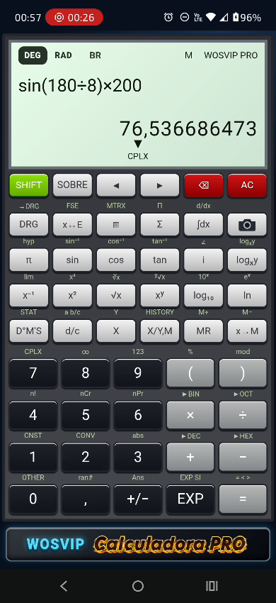
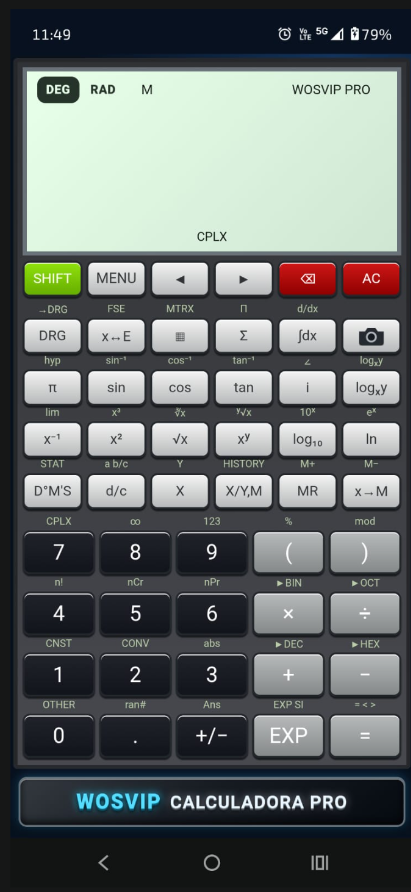
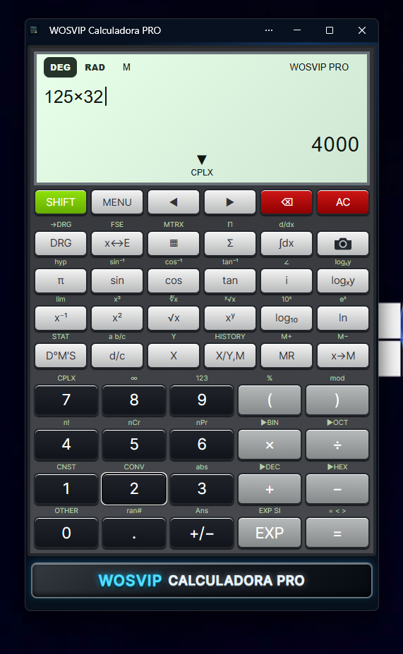
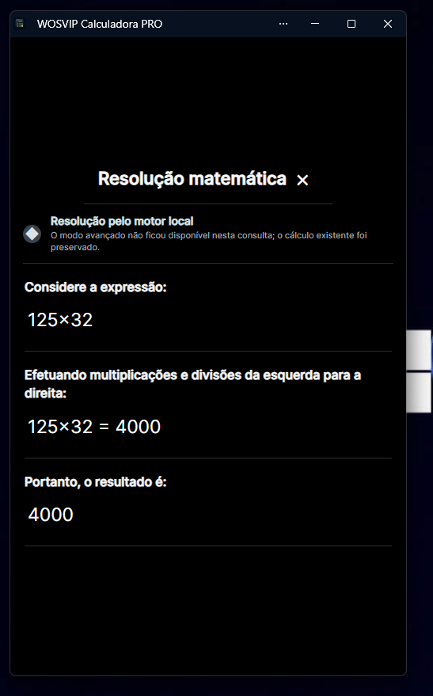
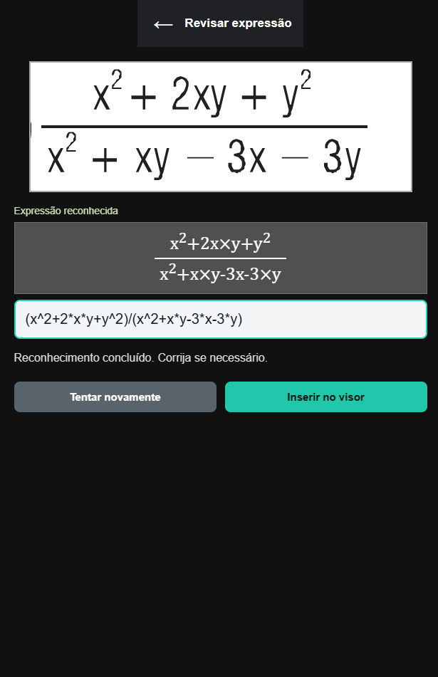
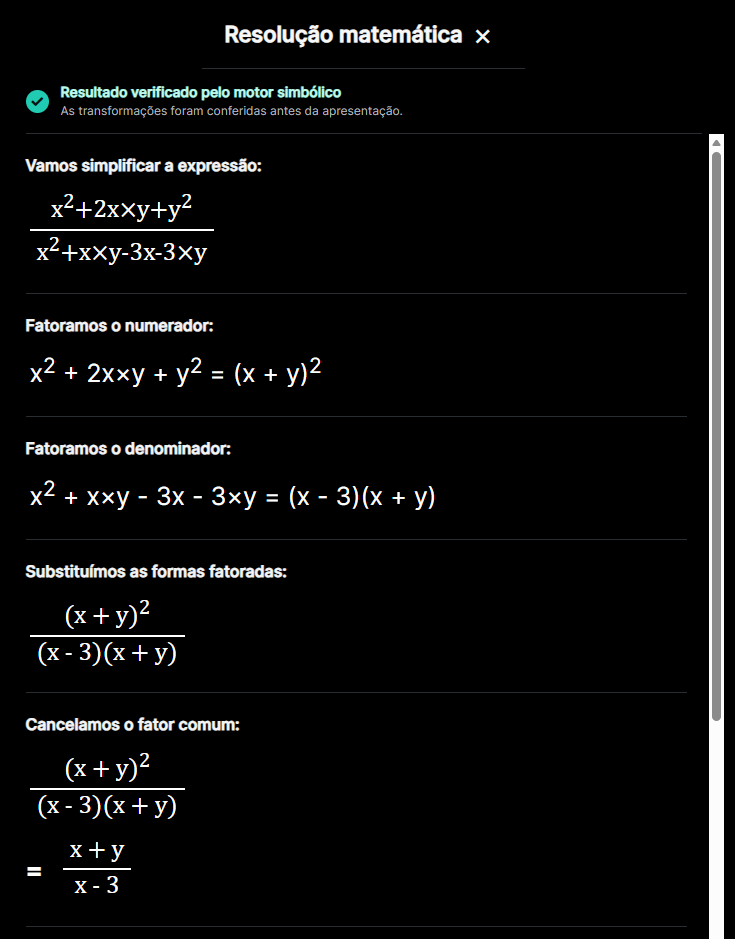
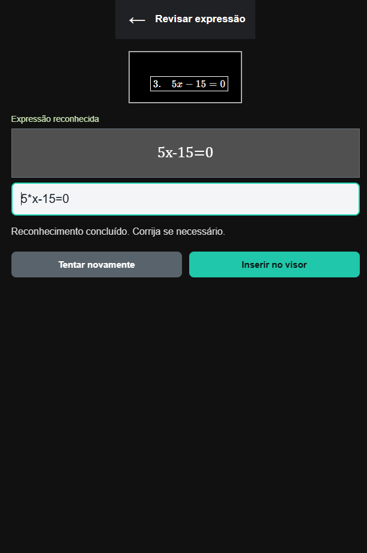
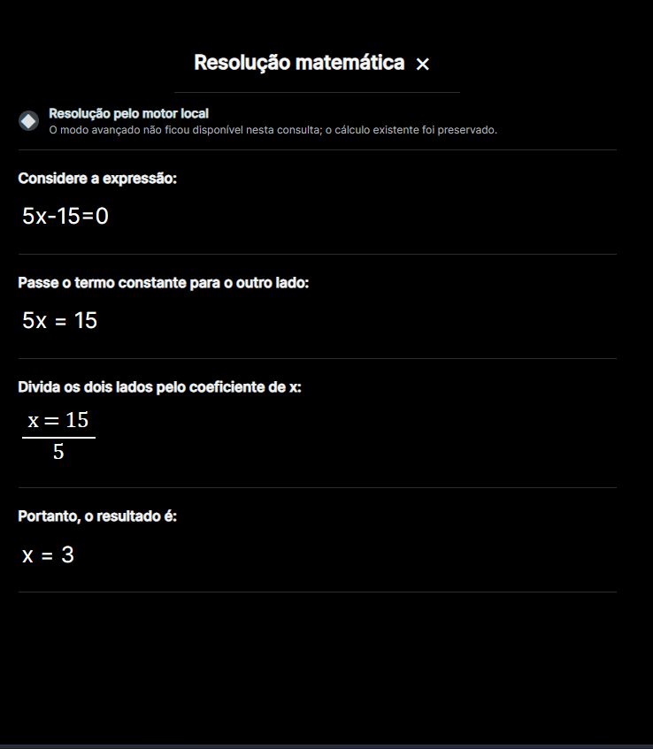
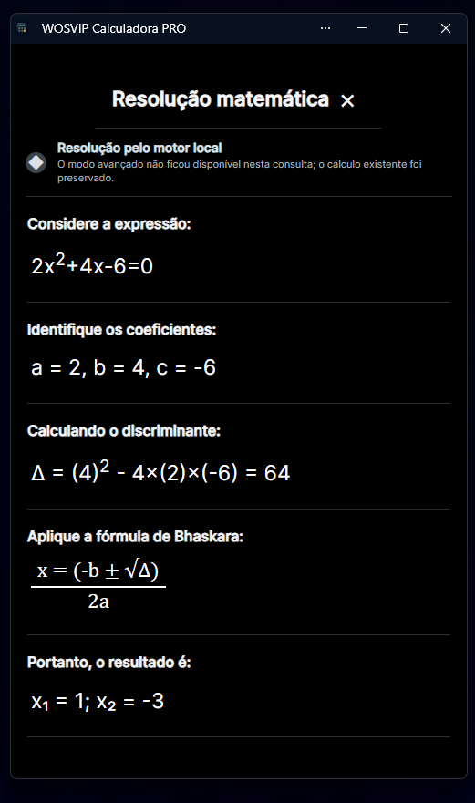

# WOSVIP Calculadora PRO®

  <strong>Calculadora científica instalável com reconhecimento matemático por câmera e resolução passo a passo.</strong>

  
  
  
  
  

  <a href="https://wosvip.github.io/wosvip-calculadora-pro/"><strong>ABRIR A WOSVIP CALCULADORA PRO</strong></a>

## Sobre o projeto

A **WOSVIP Calculadora PRO** combina a aparência de uma calculadora científica física com recursos modernos para matemática, engenharia e estudos. O projeto funciona diretamente no navegador e também pode ser instalado como aplicativo no Windows e no Android.

A expressão é formatada no visor, o resultado numérico aparece instantaneamente quando possível e a seta **▼** abre uma explicação matemática organizada. A câmera permite fotografar fórmulas, revisar o reconhecimento e enviar a expressão para o visor.

## Aplicativo validado

O enquadramento e a instalação foram testados como PWA no **Windows** e no **Moto G77**.

### Demonstração em vídeo

  

  <a href="https://wosvip.github.io/wosvip-calculadora-pro/docs/videos/wosvip-calculadora-pro.mp4"><strong>▶ ASSISTIR À DEMONSTRAÇÃO DA CALCULADORA</strong></a> 
  Vídeo curto mostrando a utilização no celular e a identidade animada da Calculadora PRO.

<table>
  <tr>
    <td align="center"><strong>Aplicativo no Moto G77</strong></td>
    <td align="center"><strong>Aplicativo instalado no Windows</strong></td>
  </tr>
  <tr>
    <td align="center"></td>
    <td align="center"></td>
  </tr>
</table>

## Recursos principais

### Calculadora científica

- Operações básicas, porcentagem e troca de sinal
- Potências e raízes quadrada, cúbica e de índice variável
- Seno, cosseno, tangente e funções trigonométricas inversas
- Modos angulares **DEG** e **RAD**
- Logaritmo decimal, logaritmo natural, exponenciais e constante π
- Fatorial, combinações, permutações e módulo
- Parênteses e edição da expressão pelas setas direcionais
- Memória, resposta anterior e histórico persistente
- Números complexos e conversões entre bases numéricas

### Resultado instantâneo e tecla igual

O resultado aparece enquanto a expressão é digitada. A tecla **=** confirma a resposta e permite continuar o cálculo usando o resultado anterior.

Exemplo: `32 × 2` mostra `64`; depois de confirmar, é possível continuar com `× 2` para obter `128`.

### Tecla SOBRE

A tecla **SOBRE** abre, dentro da própria calculadora, uma apresentação completa do aplicativo. O card reúne os recursos científicos, o funcionamento da câmera, a instalação, o modo offline, a privacidade, as tecnologias e as observações de precisão sem retirar o usuário do cálculo.

### Resolução matemática passo a passo

A seta **▼** abre uma tela de resolução com fundo escuro, fórmulas em destaque e divisórias discretas. Dependendo do cálculo, o aplicativo apresenta:

- ordem das operações;
- transformação de raízes em potências;
- simplificação de frações algébricas;
- fatoração e cancelamento de fatores comuns;
- restrições da expressão original;
- equações do primeiro grau;
- fórmula de Bhaskara e equações do segundo grau;
- raízes reais ou complexas.

  

## Reconhecimento matemático pela câmera

A tecla de câmera abre um fluxo próprio para captura de expressões:

1. Abra a câmera ou selecione uma imagem.
2. Ajuste o enquadramento da fórmula.
3. Aguarde o reconhecimento matemático.
4. Revise e, se necessário, edite a expressão reconhecida.
5. Toque em **Inserir no visor**.
6. Use a seta **▼** para consultar a resolução.

O campo de revisão é importante para remover numeração de exercícios ou corrigir algum caractere antes de calcular.

> [!IMPORTANT]
> **A fórmula reconhecida pode ser corrigida imediatamente.** Se o conteúdo exibido pela câmera não estiver idêntico à fórmula original, toque no campo da fórmula reconhecida e edite números, sinais, letras ou expoentes. Depois de conferir a correção, toque em **Inserir no visor** para realizar o cálculo.

### Expressões algébricas com duas variáveis

O leitor e o motor simbólico aceitam `x`, `y`, produtos como `2xy`, potências e frações algébricas.

<table>
  <tr>
    <td align="center"><strong>Expressão reconhecida</strong></td>
    <td align="center"><strong>Simplificação simbólica</strong></td>
  </tr>
  <tr>
    <td align="center"></td>
    <td align="center"></td>
  </tr>
</table>

### Equações do primeiro e segundo graus

O aplicativo identifica os coeficientes, resolve a equação e apresenta as transformações matemáticas.

<table>
  <tr>
    <td align="center"><strong>Leitura e revisão</strong></td>
    <td align="center"><strong>Equação do primeiro grau</strong></td>
    <td align="center"><strong>Equação do segundo grau</strong></td>
  </tr>
  <tr>
    <td align="center"></td>
    <td align="center"></td>
    <td align="center"></td>
  </tr>
</table>

## Outras ferramentas

- Integral definida e derivada numérica
- Limites, somatórios e produtórios
- Conversor de unidades para engenharia
- Juros simples e compostos
- Parcelas de financiamento
- Gráficos de funções
- Conversões binárias, octais, decimais e hexadecimais
- Estatística, memória e histórico local

## Instalação

### Android

1. Abra a [versão publicada](https://wosvip.github.io/wosvip-calculadora-pro/) no Chrome.
2. Toque em **Instalar** ou abra o menu do navegador.
3. Escolha **Instalar aplicativo**.
4. Confirme e abra pelo ícone criado na tela inicial.

### Windows

1. Abra a [calculadora](https://wosvip.github.io/wosvip-calculadora-pro/) no Chrome ou Edge.
2. Clique no ícone de instalação da barra de endereço ou abra o menu.
3. Selecione **Instalar WOSVIP Calculadora PRO**.
4. O aplicativo será aberto em uma janela própria, sem a barra do navegador.

## Funcionamento online e offline

Depois da primeira abertura, a interface e o motor principal ficam armazenados pelo service worker. Operações numéricas, trigonometria, raízes, equações e várias ferramentas continuam disponíveis localmente.

O reconhecimento por câmera necessita de internet na primeira utilização para baixar o modelo matemático. Após o download, o navegador poderá reutilizar os arquivos armazenados em cache. A disponibilidade depende das regras de armazenamento do navegador e do dispositivo.

## Privacidade

- Não é necessário criar conta.
- Cálculos, memória, histórico e preferências ficam no dispositivo.
- A imagem é processada pelo mecanismo executado no navegador.
- O usuário sempre revisa a expressão antes de enviá-la ao visor.

## Tecnologias

- HTML5, CSS3 e JavaScript puro
- Progressive Web App, Web App Manifest e Service Worker
- Canvas e APIs de câmera do navegador
- Transformers.js e ONNX Runtime Web
- FormulaNet para reconhecimento de expressões matemáticas
- Pyodide e SymPy para transformações simbólicas avançadas
- GitHub Pages para hospedagem

## Estrutura do projeto

| Arquivo | Responsabilidade |
|---|---|
| `index.html` | Estrutura da interface |
| `styles.css` | Visual, responsividade e modo instalado |
| `app.js` | Teclas, cálculos, câmera e resolução local |
| `advanced-math-engine.js` | Comunicação com o motor simbólico |
| `advanced-math-worker.js` | Execução isolada do SymPy |
| `formula-ocr-worker.js` | Reconhecimento matemático em segundo plano |
| `manifest.json` | Nome, ícones e configuração do PWA |
| `sw.js` | Cache, atualização e funcionamento offline |

## Compatibilidade validada

| Plataforma | Navegadores | Situação |
|---|---|---|
| Android / Moto G77 | Chrome | Instalado e enquadrado em tela cheia |
| Windows | Chrome e Edge | Instalado em janela própria |

Outros navegadores modernos podem funcionar, mas a instalação, a câmera e o armazenamento do modelo dependem do suporte oferecido por cada navegador.

## Observações sobre precisão

O reconhecimento por imagem pode interpretar incorretamente caracteres muito pequenos, reflexos, baixa iluminação ou numeração impressa antes do exercício. Por isso, a tela de revisão permite corrigir a expressão antes do cálculo. Para resultados importantes, confira a fórmula reconhecida e as restrições matemáticas apresentadas.

---

  <strong>WOSVIP Calculadora PRO®</strong> 
  Ciência, engenharia e produtividade em uma calculadora instalável.

